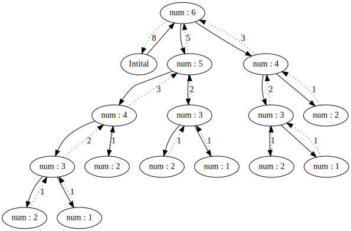

# VGraph
Minimal library to Visualize C++ recursive functions using graphviz.
# dependencies
It needs the graphviz to be additionaly installed.
specifically it requires **dot.exe**(in the system environment variables).
Graphviz can be installed from their official website - [graphviz.org/download](https://graphviz.org/download/)
# Usage 
All the heavy lifting is done by Graphviz.
1. Include the VGraph.h and VGraph.cpp in your build process.
2. Initalize the `VGraph` class and provide a name for the dot file. Ex. `VGraph vg("file.dot");` 
3. then set the number of parameters that you wish to be displayed via VGraph::setArgs function. Ex.`vg.setArgs(1);` 
4. In your Recursive function at the very start specify the parameters that you want to display using VGraph::add function. for example `vg.add("number",std::to_string(i));`. The VGraph::add function has 2 overloads.
   1. `void add(const std::string& title, const std::string& data)` here you can provide the title and parameter data as string.
   2. `void add(const std::string& title, const T& data, ftype func)` here you can provide title , data and a custom function that must return std::string and which takes in        data type T (function that converts the data of your type T into std::string) (some helper methods for this are defined in VgHelpers). 
5. then inplace of return statement of your function either 
   1. call VGraph::end() before returning (also dont do any other recursive calls after calling VGraph::end()) 
   2. or you can use the Vreturn macro for example `Vreturn(fib(i-1),fib(i-2));` or if you wish to return void then use `Vnreturn;`
6. after your function is executed in the caller function scope call `VGraph::finish()` which will store the resultant svg file. (for windows users, can call       VGraph::fLaunch() to store and open the image in the defalut svg opener.).

full example:
```cpp
#include"VGraph.h"

VGraph vg("file.dot");
int fib(int x)
{
	vg.add("num",std::to_string(x));
	if ((x == 1) || (x == 2))
	{
		Vreturn(1);
	}
	else
	{
		Vreturn(fib(x - 1) + fib(x - 2));
	}
}

int main()
{
	std::vector<int> data{ 1,2,3 };
	vg.setArgs(1);
	fib(6);
  // also can change the output format via vg.setFormat 
	vg.fLaunch(); // or vg.finish();
	return 0;
}
```
Output svg file:


